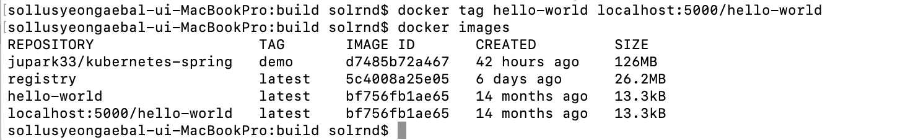
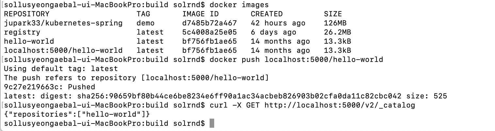

# Docker

도커 이미지 3개를 pull 한 후의 도커 이미지 목록

로컬 repository 에 저장하기 위한 이미지 생성

로컬 repository 에 push 및 결과확인

이후 과정은 IDC서버 또는 AWS S3 에 이미지 업로드. 
1. 이때 원격 repository는 https 로 설정해야 함. 따라서 SSL인증서 필수.
2. 원격 repository에는 접근가능한 IP를 등록 관리하여, 다른 IP는 접근하지 못하도록 차단한다.

