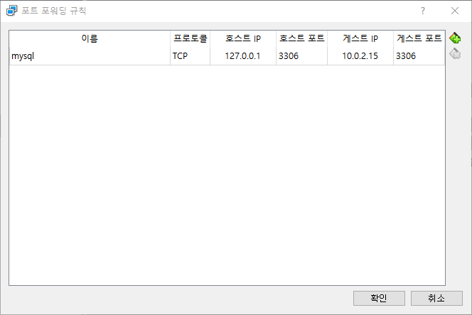
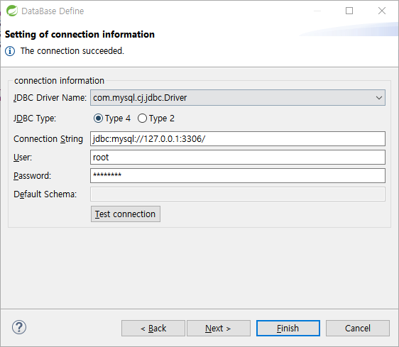

# 집에서 virtualbox 우분투 이용한 학습

ubuntu 에서 sudo 없이 docker 실행하기  
```
sudo usermod -aG docker [현재 사용자]
sudo systemctl reboot
```

호스트PC 에서 virtualbox-ubuntu에 설치된 mysql 연결 위하여 포트포워딩 설정

  
호스트PC 에서 연결 확인  

